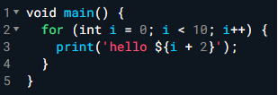
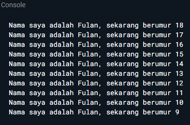
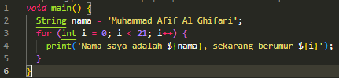
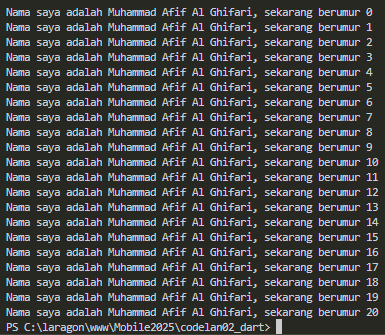

<h1>Tugas Praktikum</h1>
<h2>Soal 1</h2>
Modifikasilah kode pada baris 3 di VS Code atau Editor Code favorit Anda berikut ini agar mendapatkan keluaran (output) sesuai yang diminta!



Output yang diminta (Gantilah Fulan dengan nama Anda):


<b>Jawab :</b>
<center></center>
<center>Kode program</center><br>
<center></center>
<center>Hasil running program</center><br>


<h2>Soal 2</h2>
Mengapa sangat penting untuk memahami bahasa pemrograman Dart sebelum kita menggunakan framework Flutter ? Jelaskan!
<br><b>Jawab :</b>
Karena framework Flutter menggunakan basis bahasa dart untuk pengembangan aplikasi.

<h2>Soal 3</h2>
Rangkumlah materi dari codelab ini menjadi poin-poin penting yang dapat Anda gunakan untuk membantu proses pengembangan aplikasi mobile menggunakan framework Flutter.
<br><b>Jawab :</b>
<br>
Dart adalah bahasa pemrograman modern yang menggabungkan kelebihan beberapa bahasa tingkat tinggi dengan fitur terkini. Beberapa keunggulannya:

- Productive tooling: tersedia alat analisis kode, plugin IDE, dan ekosistem paket luas.

- Garbage collection: otomatis mengelola memori objek yang tidak terpakai.

- Type annotations (opsional): menjaga keamanan dan konsistensi data.

- Statically typed: meski anotasi opsional, Dart tetap type-safe dengan type inference untuk mendeteksi bug saat kompilasi.

- Portability: bisa dikompilasi ke JavaScript untuk web atau langsung ke kode native (ARM/x86).

Kode Dart bisa dijalankan dengan dua cara: Dart VM dan kompilasi ke JavaScript, sehingga mendukung cross-platform tanpa banyak perubahan kode.

Eksekusi kode Dart memerlukan:
- Runtime system,
- Core libraries,
- Garbage collector.

Dart mendukung dua mode kompilasi:
1. JIT (Just-In-Time) → mengkompilasi saat dijalankan, cocok untuk command line dan pengembangan (mendukung debugging & hot reload).
2. AOT (Ahead-Of-Time) → dikompilasi sebelum dijalankan, menghasilkan performa lebih tinggi, tetapi tanpa debugging & hot reload.

Dart memiliki sintaks yang mirip dengan C atau JavaScript, sehingga mudah dipahami bagi yang sudah berpengalaman dengan bahasa tersebut.

Konsep utama:

- Object-Oriented (OO): Dart berbasis OOP dengan konsep class, object, field, dan method. Mendukung encapsulation, inheritance, composition, abstraction, dan polymorphism.

- Operator: semua operator di Dart adalah method dalam class, sehingga bisa dioverride. Tidak ada tipe primitif—semua adalah object.

Jenis operator di Dart:

1. Aritmatika: +, -, *, / (hasil double), ~/ (hasil int), %, -expr (negasi), serta shortcut +=, -=, *=, /=, ~/=.

2. Increment & Decrement: ++var, var++, --var, var--.

3. Equality & Relational: ==, !=, >, <, >=, <=. Perbandingan == membandingkan isi, bukan referensi. Tidak ada === seperti di JavaScript karena sudah type-safe.

4. Logical: ! (NOT), || (OR), && (AND).

<h2>Soal 4</h2>
Buatlah penjelasan dan contoh eksekusi kode tentang perbedaan Null Safety dan Late variabel!
<br><b>Jawab :</b>
<br>
 
- Null Safety berupa pencegahan terjadinya error karena null. Apabila ingin membuat variabel bisa menampung nilai null maka digunakan tanda '?'.

```dart

    void main() {
    String nama = "Dart";// wajib ada isi
    String? panggilan;    // boleh null 

    print(nama);         // Dart
    print(panggilan);     // null
    }

```

- Late variabel merupakan variabel yang wajib tidak boleh null, tetapi inisialisasinya bisa dilakukan nanti.

```dart
    void main() {
        late String jenisHewan;
        jenisHewan = "";
        print(jenisHewan);
    }
```

<br>
<br>
<br>
Kumpulkan jawaban Anda kepada dosen pengampu sesuai kesepakatan di kelas.