<h1>Pengantar Bahasa Pemrograman Dart - Bagian 4</h1>

| Nama:   | Muhammad Afif Al Ghifari |
|---------|--------------------------|
| Kelas:  | TI-3H                    |
| NIM:    | 2341720168               |
| Absen   | 19                       |

<h2>Praktikum 1: Eksperimen Tipe Data List</h2>

1. Ketik atau salin kode program berikut ke dalam void main().
    ```dart
        var list = [1, 2, 3];
        assert(list.length == 3);
        assert(list[1] == 2);
        print(list.length);
        print(list[1]);

        list[1] = 1;
        assert(list[1] == 1);
        print(list[1]);
    ```

2. Silakan coba eksekusi (Run) kode pada langkah 1 tersebut. Apa yang terjadi? Jelaskan!<br>
Jawab:<br>
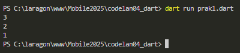<br>
program mengecek isi list dengan assert, mencetak nilai, lalu mengubah isi list dan mencetak hasil perubahannya.<br><br>


3. Ubah kode pada langkah 1 menjadi variabel final yang mempunyai index = 5 dengan default value = null. Isilah nama dan NIM Anda pada elemen index ke-1 dan ke-2. Lalu print dan capture hasilnya. Apa yang terjadi ? Jika terjadi error, silakan perbaiki.<br>
Jawab:<br>

    ```dart
        void main() {
        final list = [null, null, null, null, null];
        assert(list.length == 5);
        assert(list[1] == null);
        print(list.length);
        print(list[1]);

        list[1] = 'afif';
        list[2] = '2341720168';
        assert(list[1] == 'afif');
        assert(list[2] == '2341720168');
        print(list[1]);
        print(list[2]);
        }
    ```
    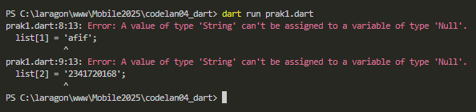<br>
    Terjadi error karena nilai dengan tipe data string tidak bisa dimasukkan ke null.<br>

    ```dart
        void main() {
        final List<String?> list = [null, null, null, null, null]; // perbaikan
        
        //...
        }
    ```

    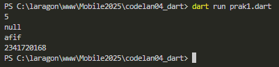<br>

<h2>Praktikum 2: Eksperimen Tipe Data Set</h2>

1. Ketik atau salin kode program berikut ke dalam fungsi main().

    ```dart
    var halogens = {'fluorine', 'chlorine', 'bromine', 'iodine', 'astatine'};
    print(halogens);
    ```

2. Silakan coba eksekusi (Run) kode pada langkah 1 tersebut. Apa yang terjadi? Jelaskan! Lalu perbaiki jika terjadi error.<br>
Jawab:<br>
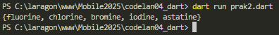<br>
Program membuat array menggunakan Set<br><br>

3. Tambahkan kode program berikut, lalu coba eksekusi (Run) kode Anda.

    ```dart
    var names1 = <String>{};
    Set<String> names2 = {}; // This works, too.
    var names3 = {}; // Creates a map, not a set.

    print(names1);
    print(names2);
    print(names3);

    ```
    Apa yang terjadi ? Jika terjadi error, silakan perbaiki namun tetap menggunakan ketiga variabel tersebut. Tambahkan elemen nama dan NIM Anda pada kedua variabel Set tersebut dengan dua fungsi berbeda yaitu .add() dan .addAll(). Untuk variabel Map dihapus, nanti kita coba di praktikum selanjutnya.<br>
    Jawab:<br>
    ```dart
    void main() {
    // var halogens = {'fluorine', 'chlorine', 'bromine', 'iodine', 'astatine'};
    // print(halogens);

        var names1 = <String>{};
        Set<String> names2 = {}; // This works, too.
        var names3 = {}; // Creates a map, not a set.

        print(names1);
        print(names2);
        print(names3);
    }
    ```
    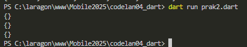<br>
    program tidak error melainkan hanya mengembalikan tiga array kosong<br>
    ```dart
    void main() {
    // var halogens = {'fluorine', 'chlorine', 'bromine', 'iodine', 'astatine'};
    // print(halogens);

        var names1 = <String>{};
        Set<String> names2 = {}; // This works, too.
        names1.add('afif');
        names1.add('2341720168');
        names2.addAll({'afif','2341720168'});

        print(names1);
        print(names2);
    }
    ```
    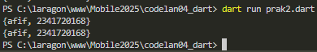<br>

<h2>Praktikum 3: Eksperimen Tipe Data Maps</h2>

1. Ketik atau salin kode program berikut ke dalam fungsi main().
    ```dart
    var gifts = {
        // Key:    Value
        'first': 'partridge',
        'second': 'turtledoves',
        'fifth': 1
    };

    var nobleGases = {
        2: 'helium',
        10: 'neon',
        18: 2,
    };

    print(gifts);
    print(nobleGases);
    ```

2. Silakan coba eksekusi (Run) kode pada langkah 1 tersebut. Apa yang terjadi? Jelaskan! Lalu perbaiki jika terjadi error.<br>
Jawab:<br>
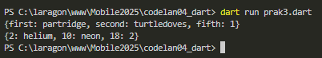<br>
Program membuat array menggunakan Map<br><br>


3. Tambahkan kode program berikut, lalu coba eksekusi (Run) kode Anda.
    
    ```dart
    var mhs1 = Map<String, String>();
    gifts['first'] = 'partridge';
    gifts['second'] = 'turtledoves';
    gifts['fifth'] = 'golden rings';

    var mhs2 = Map<int, String>();
    nobleGases[2] = 'helium';
    nobleGases[10] = 'neon';
    nobleGases[18] = 'argon';
    ```
    Apa yang terjadi ? Jika terjadi error, silakan perbaiki.

    Tambahkan elemen nama dan NIM Anda pada tiap variabel di atas (gifts, nobleGases, mhs1, dan mhs2). Dokumentasikan hasilnya dan buat laporannya!.<br>
    Jawab:<br>
    ```dart
    void main() {
        var gifts = {
            // Key:    Value
            'first': 'partridge',
            'second': 'turtledoves',
            'fifth': 1
        };

        var nobleGases = {
            2: 'helium',
            10: 'neon',
            18: 2,
        };

        print(gifts);
        print(nobleGases);

        var mhs1 = Map<String, String>();
        gifts['first'] = 'partridge';
        gifts['second'] = 'turtledoves';
        gifts['fifth'] = 'golden rings';

        var mhs2 = Map<int, String>();
        nobleGases[2] = 'helium';
        nobleGases[10] = 'neon';
        nobleGases[18] = 'argon';

        print(gifts);
        print(nobleGases);
    }
    ```
    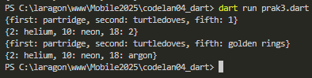<br>
    program mengganti nilai index 'fifth' dari array gifts dan nilai index 18 di array nobbleGases.<br>
    ```dart
    void main() {
        var gifts = {
            // Key:    Value
            'first': 'partridge',
            'second': 'turtledoves',
            'fifth': 1,
            'nama': 'afif', // perubahan
            'nim': '2341720168', //perubahan
        };

        var nobleGases = {
            2: 'helium',
            10: 'neon',
            18: 2,
            'nama': 'afif', // perubahan
            'nim': '2341720168', //perubahan
        };

        //...

        var mhs1 = Map<String, String>();
        mhs1['nama'] = 'afif'; // perubahan
        mhs1['nim'] = '2341720168'; // perubahan
        //...

        var mhs2 = Map<int, String>();
        mhs1[0] = 'afif'; // perubahan
        mhs1[1] = '2341720168'; // perubahan
        //...
        print(mhs1);
        print(mhs2);
    }
    ```
    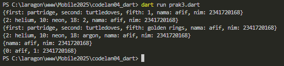<br>

<h2>Praktikum 4: Eksperimen Tipe Data List: Spread dan Control-flow Operators</h2>

1. Ketik atau salin kode program berikut ke dalam fungsi main().
    ```dart
        var list = [1, 2, 3];
        var list2 = [0, ...list];
        print(list1);
        print(list2);
        print(list2.length);
    ```

2. Silakan coba eksekusi (Run) kode pada langkah 1 tersebut. Apa yang terjadi? Jelaskan! Lalu perbaiki jika terjadi error.<br>
    Jawab:<br>
    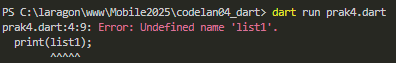<br>
    Terjadi error karena variabel 'list1' tidak ada.

    ```dart
        var list = [1, 2, 3];
        var list2 = [0, ...list];
        print(list); // perbaikan
        print(list2);
        print(list2.length);
    ```

    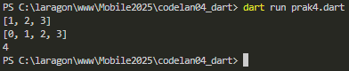

<br>

3. Tambahkan kode program berikut, lalu coba eksekusi (Run) kode Anda.
    ```dart
    list1 = [1, 2, null];
    print(list1);
    var list3 = [0, ...?list1];
    print(list3.length);
    ```
    Apa yang terjadi ? Jika terjadi error, silakan perbaiki. Tambahkan variabel list berisi NIM Anda menggunakan Spread Operators. Dokumentasikan hasilnya dan buat laporannya!<br>
    Jawab:<br>
    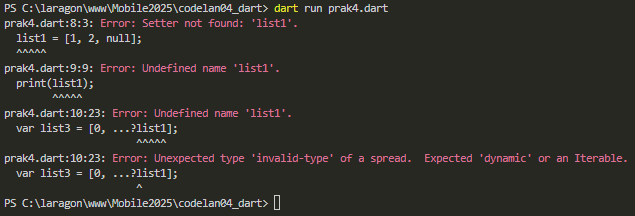<br>
    Terjadi error karena variabel 'list1' belum terdefinisikan.

    ```dart
        void main(List<String> args) {
            var list = [1, 2, 3];
            var list2 = [0, ...list];
            print(list);
            print(list2);
            print(list2.length);

            var list1 = [1, 2, null];
            print(list1);
            var list3 = [0, ...?list1];
            print(list3.length);
        }
    ```

    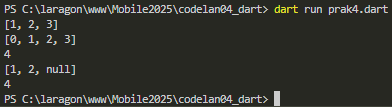
<br>

4. Tambahkan kode program berikut, lalu coba eksekusi (Run) kode Anda.
    ```dart
        var nav = ['Home', 'Furniture', 'Plants', if (promoActive) 'Outlet'];
        print(nav);
    ```
    Apa yang terjadi ? Jika terjadi error, silakan perbaiki. Tunjukkan hasilnya jika variabel promoActive ketika true dan false.<br>
    Jawab:<br>
    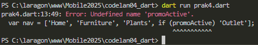<br>
    Terjadi error karena variabel 'promoActive' belum terdefinisikan.

    ```dart
        void main(List<String> args) {
            var list = [1, 2, 3];
            var list2 = [0, ...list];
            print(list);
            print(list2);
            print(list2.length);

            var list1 = [1, 2, null];
            print(list1);
            var list3 = [0, ...?list1];
            print(list3.length);

            var promoActive = true; // perbaikan
            var nav = ['Home', 'Furniture', 'Plants', if (promoActive) 'Outlet'];
            print(nav);
        }
    ```

    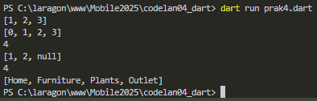
<br>

5. Tambahkan kode program berikut, lalu coba eksekusi (Run) kode Anda.
    ```dart
        var nav2 = ['Home', 'Furniture', 'Plants', if (login case 'Manager') 'Inventory'];
        print(nav2);
    ```
    Apa yang terjadi ? Jika terjadi error, silakan perbaiki. Tunjukkan hasilnya jika variabel login mempunyai kondisi lain.<br>
    Jawab:<br>
    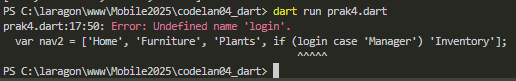<br>
    Terjadi error karena variabel 'login' belum terdefinisikan.

    ```dart
        void main(List<String> args) {
            var list = [1, 2, 3];
            var list2 = [0, ...list];
            print(list);
            print(list2);
            print(list2.length);

            var list1 = [1, 2, null];
            print(list1);
            var list3 = [0, ...?list1];
            print(list3.length);

            var promoActive = true;
            var nav = ['Home', 'Furniture', 'Plants', if (promoActive) 'Outlet'];
            print(nav);

            var login = 'Manager'; // perbaikan
            var nav2 = ['Home', 'Furniture', 'Plants', if (login case 'Manager') 'Inventory'];
            print(nav2);
        }
    ```

    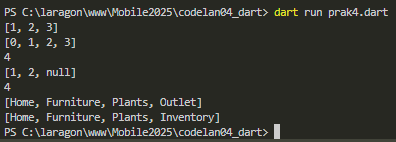
<br>

6. ambahkan kode program berikut, lalu coba eksekusi (Run) kode Anda.
    ```dart
        var listOfInts = [1, 2, 3];
        var listOfStrings = ['#0', for (var i in listOfInts) '#$i'];
        assert(listOfStrings[1] == '#1');
        print(listOfStrings);
    ```
    Apa yang terjadi ? Jika terjadi error, silakan perbaiki. Jelaskan manfaat Collection For dan dokumentasikan hasilnya.<br>
    Jawab:<br>
    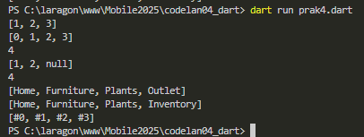<br>
    Tidak terjadi error. Collection for bisa membuat list baru dari list lain tanpa harus pakai loop terpisah.

<br>

<h2>Praktikum 5: Eksperimen Tipe Data Records</h2>

1. Ketik atau salin kode program berikut ke dalam fungsi main().
    ```dart
        var record = ('first', a: 2, b: true, 'last');
        print(record)
    ```

2. Silakan coba eksekusi (Run) kode pada langkah 1 tersebut. Apa yang terjadi? Jelaskan! Lalu perbaiki jika terjadi error.<br>
    Jawab:<br>
    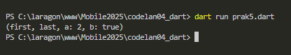<br>
    Tidak terjadi error.

<br>

3. Tambahkan kode program berikut di luar scope void main(), lalu coba eksekusi (Run) kode Anda. 
    ```dart
        (int, int) tukar((int, int) record) {
            var (a, b) = record;
            return (b, a);
        }
    ```
    Apa yang terjadi ? Jika terjadi error, silakan perbaiki. Gunakan fungsi tukar() di dalam main() sehingga tampak jelas proses pertukaran value field di dalam Records.<br>
    Jawab:<br>
    ```dart
        void main() {
            var record = ('first', a: 2, b: true, 'last');
            print(record);

            var angka = (5,6);
            var record2 = tukar(angka);
            print(record2);
        }

        (int, int) tukar((int, int) record) {
            var (a, b) = record;
            return (b, a);
        }

    ```
    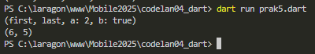<br>
    Fungsi tukar() menerima record (int, int), lalu membalik urutan nilainya dengan pattern matching var (a, b) = record;.

<br>

4. Tambahkan kode program berikut di dalam scope void main(), lalu coba eksekusi (Run) kode Anda. 
    ```dart
    // Record type annotation in a variable declaration:
    (String, int) mahasiswa;
    print(mahasiswa);
    ```
    Apa yang terjadi ? Jika terjadi error, silakan perbaiki. Inisialisasi field nama dan NIM Anda pada variabel record mahasiswa di atas. Dokumentasikan hasilnya dan buat laporannya!<br>
    Jawab:<br>
    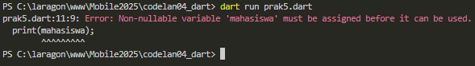<br>
    Terjadi error karena variabel 'mahasiswa' belum terinisialisasi.

    ```dart
        void main() {
            var record = ('first', a: 2, b: true, 'last');
            print(record);

            var angka = (5,6);
            var record2 = tukar(angka);
            print(record2);

            // Record type annotation in a variable declaration:
            (String, int) mahasiswa;
            mahasiswa = ('afif', 2341720168); //perbaikan
            print(mahasiswa);
        }

        (int, int) tukar((int, int) record) {
            var (a, b) = record;
            return (b, a);
        }

    ```

    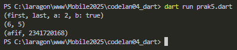

5. Tambahkan kode program berikut di dalam scope void main(), lalu coba eksekusi (Run) kode Anda. 
    ```dart
        var mahasiswa2 = ('first', a: 2, b: true, 'last');

        print(mahasiswa2.$1); // Prints 'first'
        print(mahasiswa2.a); // Prints 2
        print(mahasiswa2.b); // Prints true
        print(mahasiswa2.$2); // Prints 'last'
    ```
    Apa yang terjadi ? Jika terjadi error, silakan perbaiki. Gantilah salah satu isi record dengan nama dan NIM Anda, lalu dokumentasikan hasilnya dan buat laporannya!<br>
    Jawab:<br>
    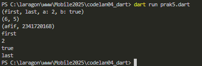<br>
    Tidak terjadi error. tetapi Record di Dart tidak bisa diubah nilainya setelah dibuat

    ```dart
        void main() {
            var record = ('first', a: 2, b: true, 'last');
            print(record);

            var angka = (5, 6);
            var record2 = tukar(angka);
            print(record2);

            // Record type annotation in a variable declaration:
            (String, int) mahasiswa;
            mahasiswa = ('afif', 2341720168);
            print(mahasiswa);

            var mahasiswa2 = ('afif', a: 2, b: true, '2341720168'); // perubahan

            print(mahasiswa2.$1);
            print(mahasiswa2.a);
            print(mahasiswa2.b);
            print(mahasiswa2.$2); 
        }

        (int, int) tukar((int, int) record) {
            var (a, b) = record;
            return (b, a);
        }


    ```

    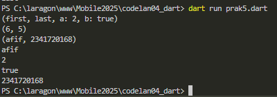

<h2>Tugas Praktikum</h2>

1. Silakan selesaikan Praktikum 1 sampai 5, lalu dokumentasikan berupa screenshot hasil pekerjaan Anda beserta penjelasannya!

2. Jelaskan yang dimaksud Functions dalam bahasa Dart!<br>
    Jawab:<br>
    Fungsi adalah blok kode yang dapat dipanggil untuk menjalankan tugas tertentu, bisa menerima input (parameter) dan menghasilkan output (return value).
    <br>
3.  Jelaskan jenis-jenis parameter di Functions beserta contoh sintaksnya!
    <br>
    Jawab:<br>
    - Positional Parameter (urutan penting)
        ```dart
            void greet(String name, int age) {
                print("Halo $name, umur $age");
            }
        ```
    - Optional Positional Parameter (diberi [])
        ```dart
            void greet([String? name]) {
                print("Halo ${name ?? 'Guest'}");
            }
        ```
    - Named Parameter (diberi {})
        ```dart
            void greet({String name = "Afif"}) {
                print("Halo $name");
            }
        ```
    <br>
4. Jelaskan maksud Functions sebagai first-class objects beserta contoh sintaknya!
    <br>
    Jawab:<br>
    Artinya fungsi bisa disimpan dalam variabel, dikirim sebagai argumen, atau dikembalikan dari fungsi lain.
    ```dart
    void sapa(String name) => print("Halo $name");

    void main() {
        var f = sapa;   // simpan di variabel
        f("Afif");      // panggil
    }
    ```
    <br>
5. Apa itu Anonymous Functions? Jelaskan dan berikan contohnya!
    <br>
    Jawab:<br>
    Fungsi tanpa nama, biasanya digunakan sekali pakai.
    ```dart
    var list = [1, 2, 3];
    list.forEach((n) {
        print(n * n);
    });
    ```
    <br>
6. Jelaskan perbedaan Lexical scope dan Lexical closures! Berikan contohnya!
    <br>
    Jawab:<br>
    - Lexical Scope: Variabel hanya bisa diakses dalam blok tempat ia didefinisikan.
        ```dart
            void main() {
                int x = 10;
                void printX() {
                    print(x); // bisa akses karena dalam scope
                }
                printX();
            }
        ```
    - Lexical Closure: Fungsi bisa "mengingat" variabel dari scope luar meski scope luar sudah selesai dieksekusi.
        ```dart
            Function counter() {
                int count = 0;
                return () {
                    count++;
                    return count;
                };
            }

            var c = counter();
            print(c()); // 1
            print(c()); // 2
        ```
    <br>
7. Jelaskan dengan contoh cara membuat return multiple value di Functions!
    <br>
    Jawab:<br>
    Bisa menggunakan record/tuple atau list/map.
    ```dart
        (String, int) getUser() {
            return ('Afif', 20);
        }

        void main() {
            var (name, age) = getUser();
            print("$name - $age");
        }

    ```
    <br>