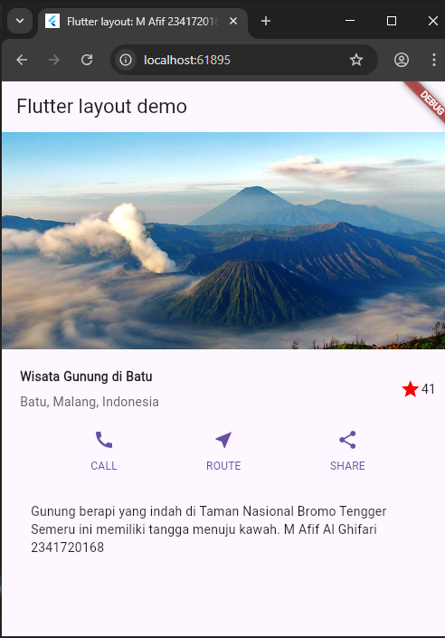

# Pengantar Bahasa Pemrograman Dart - Bagian 6

| Nama:   | Muhammad Afif Al Ghifari |
|---------|--------------------------|
| Kelas:  | TI-3H                    |
| NIM:    | 2341720168               |
| Absen   | 19                       |

## Praktikum 1: Membangun Layout di Flutter

```dart
Widget titleSection = Container(
  padding: const EdgeInsets.all(...),
  child: Row(
    children: [
      Expanded(
        /* soal 1*/
        child: Column(
          crossAxisAlignment: ...,
          children: [
            /* soal 2*/
            Container(
              padding: const EdgeInsets.only(bottom: ...),
              child: const Text(
                'Wisata Gunung di Batu',
                style: TextStyle(
                  fontWeight: FontWeight.bold,
                ),
              ),
            ),
            Text(
              'Batu, Malang, Indonesia',
              style: TextStyle(...),
            ),
          ],
        ),
      ),
      /* soal 3*/
      Icon(
       ...,
        color: ...,
      ),
      const Text(...),
    ],
  ),
);
```

/* soal 1 */ Letakkan widget Column di dalam widget Expanded agar menyesuaikan ruang yang tersisa di dalam widget Row. Tambahkan properti crossAxisAlignment ke CrossAxisAlignment.start sehingga posisi kolom berada di awal baris.

/* soal 2 */ Letakkan baris pertama teks di dalam Container sehingga memungkinkan Anda untuk menambahkan padding = 8. Teks ‘Batu, Malang, Indonesia' di dalam Column, set warna menjadi abu-abu.

/* soal 3 */ Dua item terakhir di baris judul adalah ikon bintang, set dengan warna merah, dan teks "41". Seluruh baris ada di dalam Container dan beri padding di sepanjang setiap tepinya sebesar 32 piksel. Kemudian ganti isi body text ‘Hello World' dengan variabel titleSection seperti berikut:

### Hasil

Sebelum:
<br><br>
Sesudah


```dart
/* soal 1*/
        child: Column(
          crossAxisAlignment: CrossAxisAlignment.start,
          children: [
            /* soal 2*/
            Container(
              padding: const EdgeInsets.only(bottom: 8),
              child: const Text(
                'Wisata Gunung di Batu',
                style: TextStyle(
                  fontWeight: FontWeight.bold,
                ),
              ),
            ),
            Text(
              'Batu, Malang, Indonesia',
              style: TextStyle(color: Color.fromARGB(255, 104, 104, 104)),
            ),
          ],
        ),
      ),
      /* soal 3*/
      Icon(
        Icons.star,
        color: Color.fromARGB(255, 238, 8, 8),
      ),
      const Text('41'),
```

## Praktikum 2: Implementasi button row

1. Buat method Column _buildButtonColumn

```dart
class MyApp extends StatelessWidget {
  const MyApp({super.key});

  @override
  Widget build(BuildContext context) {
    // ···
  }

  Column _buildButtonColumn(Color color, IconData icon, String label) {
    return Column(
      mainAxisSize: MainAxisSize.min,
      mainAxisAlignment: MainAxisAlignment.center,
      children: [
        Icon(icon, color: color),
        Container(
          margin: const EdgeInsets.only(top: 8),
          child: Text(
            label,
            style: TextStyle(
              fontSize: 12,
              fontWeight: FontWeight.w400,
              color: color,
            ),
          ),
        ),
      ],
    );
  }
}
```

2. Buat widget buttonSection

```dart
Color color = Theme.of(context).primaryColor;

Widget buttonSection = Row(
  mainAxisAlignment: MainAxisAlignment.spaceEvenly,
  children: [
    _buildButtonColumn(color, Icons.call, 'CALL'),
    _buildButtonColumn(color, Icons.near_me, 'ROUTE'),
    _buildButtonColumn(color, Icons.share, 'SHARE'),
  ],
);
```

Hasil<br>
Sebelum:
<br><br>
Sesudah:


## Praktikum 3: Implementasi text section

1. Langkah 1: Buat widget textSection
```dart
Widget textSection = Container(
  padding: const EdgeInsets.all(32),
  child: const Text(
    'Carilah teks di internet yang sesuai '
    'dengan foto atau tempat wisata yang ingin '
    'Anda tampilkan. '
    'Tambahkan nama dan NIM Anda sebagai '
    'identitas hasil pekerjaan Anda. '
    'Selamat mengerjakan 🙂.',
    softWrap: true,
  ),
);
```

Hasil<br>
Sebelum:
<br><br>
Sesudah:


## Praktikum 4: Implementasi image section

1. Langkah 1: Siapkan aset gambar
pubsec.yaml
```dart
flutter:
  uses-material-design: true
  assets:
    - Bromo-Semeru-Batok-Widodaren.jpg
```

2. Langkah 2: Tambahkan gambar ke body
```dart
body: Column(children: [
          Image.asset(
            'images/Bromo-Semeru-Batok-Widodaren.jpg', width: 600, height: 240, fit: BoxFit.cover
          ),
          titleSection, 
          buttonSection, 
          textSection
          ]),
```

3. Langkah 3: Terakhir, ubah menjadi ListView
```dart
body: ListView(children: [
          Image.asset(
            'Bromo-Semeru-Batok-Widodaren.jpg', width: 600, height: 240, fit: BoxFit.cover
          ),
          titleSection, 
          buttonSection, 
          textSection
          ]),
```
Hasil<br>
Sebelum:
<br><br>
Sesudah:


## Tugas Praktikum 1

Silakan implementasikan di project baru "basic_layout_flutter" dengan mengakses sumber ini: https://docs.flutter.dev/codelabs/layout-basics

basic_layout_flutter/lib/main.dart
```dart
import 'package:flutter/material.dart';

void main() => runApp(MyApp());

class MyApp extends StatelessWidget {
  MyApp({Key? key}) : super(key: key);

  @override
  Widget build(BuildContext context) {
    Color color = Theme.of(context).primaryColor;

    Widget buttonSection = Row(
      mainAxisAlignment: MainAxisAlignment.spaceEvenly,
      children: [
        _buildButtonColumn(color, Icons.call, 'CALL'),
        _buildButtonColumn(color, Icons.near_me, 'ROUTE'),
        _buildButtonColumn(color, Icons.share, 'SHARE'),
      ],
    );

    Widget textSection = Container(
      padding: const EdgeInsets.all(32),
      child: const Text(
        'Lintasan balap di bawah bayang-bayang Gunung Fuji '
        'dengan salah satu lintasan lurus terpanjang '
        'di dunia balap. '
        'M Afif Al Ghifari 2341720168 ',
        softWrap: true,
      ),
    );

    return MaterialApp(
      title: 'Hot Kerbs: M Afif 2341720168',
      home: Scaffold(
        appBar: AppBar(title: const Text('Hot Kerbs Demo')),
        body: ListView(children: [
          Image.asset(
            'img/fuji.jpg', width: 600, height: 240, fit: BoxFit.cover
          ),
          titleSection, 
          buttonSection, 
          textSection
          ]),
      ),
    );
  }

  Widget titleSection = Container(
    padding: const EdgeInsets.all(20),
    child: Row(
      children: [
        Expanded(
          /* soal 1*/
          child: Column(
            crossAxisAlignment: CrossAxisAlignment.start,
            children: [
              /* soal 2*/
              Container(
                padding: const EdgeInsets.only(bottom: 8),
                child: const Text(
                  'Fuji Speedway',
                  style: TextStyle(fontWeight: FontWeight.bold),
                ),
              ),
              Text(
                'Sunto, Shizuoka, Jepang',
                style: TextStyle(color: Color.fromARGB(255, 104, 104, 104)),
              ),
            ],
          ),
        ),
        /* soal 3*/
        Icon(Icons.star, color: Color.fromARGB(255, 238, 8, 8)),
        const Text('51'),
      ],
    ),
  );
}

Column _buildButtonColumn(Color color, IconData icon, String label) {
  return Column(
    mainAxisSize: MainAxisSize.min,
    mainAxisAlignment: MainAxisAlignment.center,
    children: [
      Icon(icon, color: color),
      Container(
        margin: const EdgeInsets.only(top: 8),
        child: Text(
          label,
          style: TextStyle(
            fontSize: 12,
            fontWeight: FontWeight.w400,
            color: color,
          ),
        ),
      ),
    ],
  );
}

```


## Praktikum 5: Membangun Navigasi di Flutter

1. Langkah 1: Siapkan project baru
  

2. Langkah 2: Mendefinisikan Route
```dart
class HomePage extends StatelessWidget {
  @override
  Widget build(BuildContext context) {
    throw UnimplementedError();
  }
}
```

3. Langkah 3: Lengkapi Kode di main.dart
```dart
void main() {
runApp(MaterialApp(
    initialRoute: '/',
    routes: {
    '/': (context) => HomePage(),
    '/item': (context) => ItemPage(),
    },
  )); // MaterialApp
}
```

4. Langkah 4: Membuat data model
```dart
class Item {
String name;
int price;
Item({this.name, this.price});
}
```

5. Langkah 5: Lengkapi kode di class HomePage
```dart
class HomePage extends StatelessWidget {
  final List<Item> items = [
  Item(name: 'Sugar', price: 5000),
  Item(name: 'Salt', price: 2000)
  ];
}
```

6. Langkah 6: Membuat ListView dan itemBuilder
```dart
body: Container(
  margin: EdgeInsets.all(8),
  child: ListView.builder(
    padding: EdgeInsets.all(8),
    itemCount: items.length,
    itemBuilder: (context, index) {
      final item = items[index];
      return Card(
        child: Container(
          margin: EdgeInsets.all(8),
          child: Row(
            children: [
              Expanded(child: Text(item.name)),
              Expanded(
                child: Text(
                  item.price.toString(),
                  textAlign: TextAlign.end,
                ),
              ),
            ],
          ),
        ),
      );
    },
  ),
),
```

7. Langkah 7: Menambahkan aksi pada ListView
```dart
return InkWell(
  onTap: () => Navigator.pushNamed(context, '/item'),
```

Hasil:


## Tugas Praktikum 2

home_page.dart
```dart
import 'package:flutter/material.dart';
import 'package:belanja/models/item.dart';

class HomePage extends StatelessWidget {
  final List<Item> items = [
    Item(
      name: 'Sugar',
      price: 5000,
      photo:
          'https://upload.wikimedia.org/wikipedia/commons/thumb/3/3c/Sucre_blanc_cassonade_complet_rapadura.jpg/800px-Sucre_blanc_cassonade_complet_rapadura.jpg',
      stock: 20,
      rating: 4.5,
    ),
    Item(
      name: 'Salt',
      price: 2000,
      photo:
          'https://upload.wikimedia.org/wikipedia/commons/thumb/0/07/Comparison_of_Table_Salt_with_Kitchen_Salt.png/800px-Comparison_of_Table_Salt_with_Kitchen_Salt.png',
      stock: 35,
      rating: 4.2,
    ),
    Item(
      name: 'Flour',
      price: 6000,
      photo:
          'https://upload.wikimedia.org/wikipedia/commons/thumb/6/64/All-Purpose_Flour_%284107895947%29.jpg/800px-All-Purpose_Flour_%284107895947%29.jpg',
      stock: 15,
      rating: 4.7,
    ),
  ];

  @override
  Widget build(BuildContext context) {
    return Scaffold(
      appBar: AppBar(
        title: Text("Belanja Afif 2341720168"),
      ),
      body: Container(
        margin: EdgeInsets.all(8),
        child: GridView.builder(
          padding: EdgeInsets.all(8),
          gridDelegate: SliverGridDelegateWithFixedCrossAxisCount(
            crossAxisCount: 2, // 2 produk per baris
            crossAxisSpacing: 8,
            mainAxisSpacing: 8,
            childAspectRatio: 0.7,
          ),
          itemCount: items.length,
          itemBuilder: (context, index) {
            final item = items[index];
            return InkWell(
              onTap: () =>
                  Navigator.pushNamed(context, '/item', arguments: item),
              child: Card(
                shape: RoundedRectangleBorder(
                  borderRadius: BorderRadius.circular(12),
                ),
                elevation: 3,
                child: Column(
                  crossAxisAlignment: CrossAxisAlignment.start,
                  children: [
                    // ✅ Tambahkan Hero di sini
                    Expanded(
                      child: ClipRRect(
                        borderRadius:
                            BorderRadius.vertical(top: Radius.circular(12)),
                        child: Hero(
                          tag: 'itemImage_${item.name}', // tag unik
                          child: Image.network(
                            item.photo,
                            fit: BoxFit.cover,
                            width: double.infinity,
                          ),
                        ),
                      ),
                    ),
                    Padding(
                      padding: const EdgeInsets.all(8.0),
                      child: Column(
                        crossAxisAlignment: CrossAxisAlignment.start,
                        children: [
                          Text(
                            item.name,
                            style: TextStyle(fontWeight: FontWeight.bold),
                          ),
                          SizedBox(height: 4),
                          Text("Rp ${item.price}"),
                          SizedBox(height: 4),
                          Text("Stok: ${item.stock}"),
                          SizedBox(height: 4),
                          Row(
                            children: [
                              Icon(Icons.star, color: Colors.amber, size: 16),
                              SizedBox(width: 4),
                              Text(item.rating.toString()),
                            ],
                          ),
                        ],
                      ),
                    )
                  ],
                ),
              ),
            );
          },
        ),
      ),
    );
  }
}
```

item_page.dart
```dart
import 'package:flutter/material.dart';
import 'package:belanja/models/item.dart';

class ItemPage extends StatelessWidget {
  @override
  Widget build(BuildContext context) {
    final item = ModalRoute.of(context)!.settings.arguments as Item;

    return Scaffold(
      appBar: AppBar(
        title: Text(item.name),
      ),
      body: Column(
        children: [
          Hero(
            tag: 'itemImage_${item.name}', // sama dengan HomePage
            child: Image.network(
              item.photo,
              width: double.infinity,
              height: 300,
              fit: BoxFit.cover,
            ),
          ),
          SizedBox(height: 16),
          Text(
            item.name,
            style: TextStyle(fontSize: 24, fontWeight: FontWeight.bold),
          ),
          SizedBox(height: 8),
          Text("Harga: Rp ${item.price}"),
          SizedBox(height: 8),
          Text("Stok: ${item.stock}"),
          SizedBox(height: 8),
          Row(
            mainAxisAlignment: MainAxisAlignment.center,
            children: [
              Icon(Icons.star, color: Colors.amber),
              SizedBox(width: 4),
              Text(item.rating.toString()),
            ],
          ),
        ],
      ),
    );
  }
}
```

item.dart
```dart
// file: lib/models/item.dart
class Item {
  final String name;
  final int price;
  final String photo;
  final int stock;
  final double rating;

  Item({
    required this.name,
    required this.price,
    required this.photo,
    required this.stock,
    required this.rating,
  });
}
```

hero_image.dart
```dart
import 'package:flutter/material.dart';

class HeroImage extends StatelessWidget {
  final String tag;
  final String imageUrl;
  final double? height;
  final double? width;
  final BoxFit fit;
  final BorderRadius? borderRadius;

  const HeroImage({
    Key? key,
    required this.tag,
    required this.imageUrl,
    this.height,
    this.width,
    this.fit = BoxFit.cover,
    this.borderRadius,
  }) : super(key: key);

  @override
  Widget build(BuildContext context) {
    Widget image = Image.network(
      imageUrl,
      height: height,
      width: width,
      fit: fit,
    );

    // Jika ada borderRadius -> bungkus dengan ClipRRect
    if (borderRadius != null) {
      image = ClipRRect(
        child: image,
      );
    }

    return Hero(
      tag: tag,
      child: image,
    );
  }
}
```
