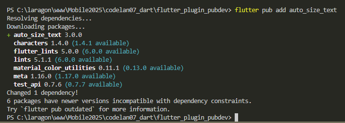

# Pengantar Bahasa Pemrograman Dart - Bagian 7

| Nama:   | Muhammad Afif Al Ghifari |
|---------|--------------------------|
| Kelas:  | TI-3H                    |
| NIM:    | 2341720168               |
| Absen   | 19                       |

## Praktikum Menerapkan Plugin di Project Flutter

### 1. Buat Project Baru


### 2. Menambahkan Plugin



### 3. Buat file red_text_widget.dart
```dart
import 'package:flutter/material.dart';

class RedTextWidget extends StatelessWidget {
  const RedTextWidget({Key? key}) : super(key: key);

  @override
  Widget build(BuildContext context) {
    return Container();
  }
}
```


### 4. Tambah Widget AutoSizeText
```dart
return AutoSizeText(
      text,
      style: const TextStyle(color: Colors.red, fontSize: 14),
      maxLines: 2,
      overflow: TextOverflow.ellipsis,
);
```


### 5. Buat Variabel text dan parameter di constructor
```dart
final String text;

const RedTextWidget({Key? key, required this.text}) : super(key: key);
```


### 6. Tambahkan widget di main.dart
```dart
Container(
   color: Colors.yellowAccent,
   width: 50,
   child: const RedTextWidget(
             text: 'You have pushed the button this many times:',
          ),
),
Container(
    color: Colors.greenAccent,
    width: 100,
    child: const Text(
           'You have pushed the button this many times:',
          ),
),
```


## Tugas Praktikum

1. Selesaikan Praktikum tersebut, lalu dokumentasikan dan push ke repository Anda berupa screenshot hasil pekerjaan beserta penjelasannya di file README.md!

2. Jelaskan maksud dari langkah 2 pada praktikum tersebut!<br>
  Jawab:<br> Untuk menambahkan plugin auto_size_text

3. Jelaskan maksud dari langkah 5 pada praktikum tersebut!<br>
  Jawab:<br> membuat widget RedTextWidget yang menerima teks sebagai parameter

4. Pada langkah 6 terdapat dua widget yang ditambahkan, jelaskan fungsi dan perbedaannya!<br>
  Jawab:<br> 
    - Membuat sebuah container dengan background kuning dan dengan teks berwarna merah
    - Membuat container dengan background hijau dan teks default yang berwarna hitam

5. Jelaskan maksud dari tiap parameter yang ada di dalam plugin auto_size_text berdasarkan tautan pada dokumentasi ini !<br>
  Jawab:<br>
    
| Parameter | Tipe | Fungsi / Penjelasan |
|---|---|---|
| `key` | Key? | Untuk identifikasi widget di tree |
| `textKey` | Key? | Kunci spesifik untuk widget `Text` internal yang dihasilkan |
| `style` | `TextStyle?` | Gaya teks (ukuran, warna, font, dsb). `AutoSizeText` akan memakai `style.fontSize` sebagai titik awal untuk auto‑resize |
| `minFontSize` | `double` | Ukuran font minimum yang diperbolehkan saat teks di‐resize ke ukuran kecil. Jika teks masih tidak muat, akan mengikuti aturan `overflow`. (Default = 12) |
| `maxFontSize` | `double` | Ukuran font maksimum yang diperbolehkan. Meski `style.fontSize` bisa lebih besar, `maxFontSize` bisa membatasi agar teks tidak membesar melebihi batas tersebut. |
| `stepGranularity` | `double` | Satuan langkah penurunan ukuran font. Misalnya jika `stepGranularity = 1`, maka proses pengecilan font akan diuji satu per satu tingkatan 1 unit. Nilai yang terlalu kecil bisa berdampak performa. |
| `presetFontSizes` | `List<double>` | Jika kamu ingin teks hanya menggunakan ukuran font tertentu (misalnya [40, 20, 14]), maka `minFontSize`, `maxFontSize`, `stepGranularity` akan diabaikan. |
| `group` | `AutoSizeGroup?` | Untuk menyinkronkan ukuran font antar beberapa `AutoSizeText`. Semua yang berada dalam satu grup akan menggunakan ukuran font yang sama — yaitu ukuran terkecil yang masih muat. |
| `textAlign` | `TextAlign?` | Penataan teks secara horizontal (kiri, tengah, kanan, justify), sama seperti pada widget `Text` biasa |
| `textDirection` | `TextDirection?` | Arah teks (LTR / RTL). Digunakan untuk interpretasi `TextAlign.start` / `end` |
| `locale` | `Locale?` | Lokalisasi untuk memilih render font yang sesuai misalnya tergantung bahasa / karakter khusus |
| `softWrap` | `bool?` | Apakah teks boleh dibungkus ke baris baru di “soft break” (kata / spasi) seperti widget `Text` biasa |
| `wrapWords` | `bool` | Jika sebuah kata tidak muat dalam satu baris, apakah kata tersebut boleh dibungkus / dipotong. Default = `true`. |
| `overflow` | `TextOverflow` | Apa yang terjadi jika teks tidak dapat dimuat lebih kecil dari `minFontSize` atau tetap overflow — misalnya `ellipsis`, `clip`, atau `fade` |
| `overflowReplacement` | `Widget?` | Widget pengganti jika teks tetap overflow (meskipun sudah di‐resize) |
| `textScaleFactor` | `double` | Skala teks (misalnya dari pengaturan aksesibilitas). Ini juga memengaruhi `minFontSize`, `maxFontSize`, dan `presetFontSizes` |
| `maxLines` | `int?` | Jumlah maksimum baris teks yang diizinkan (sama seperti `Text.maxLines`) |
| `semanticsLabel` | `String?` | Label alternatif untuk keperluan aksesibilitas (screen reader) |


6. Kumpulkan laporan praktikum Anda berupa link repository GitHub kepada dosen!