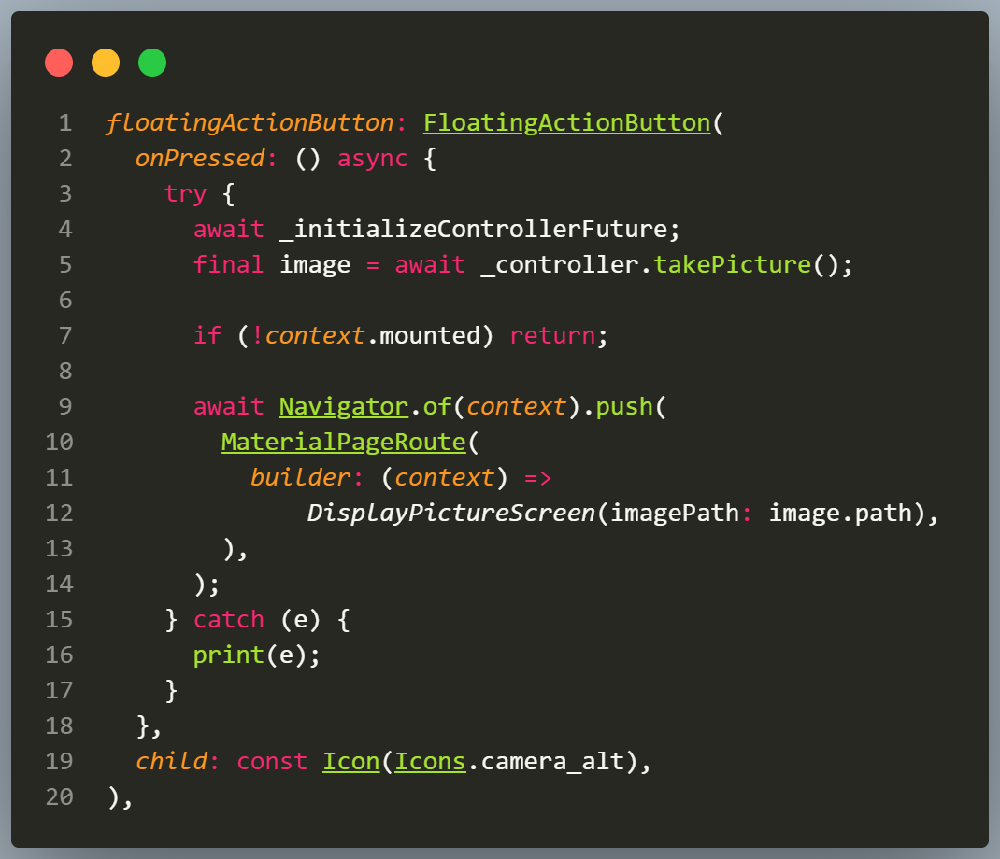
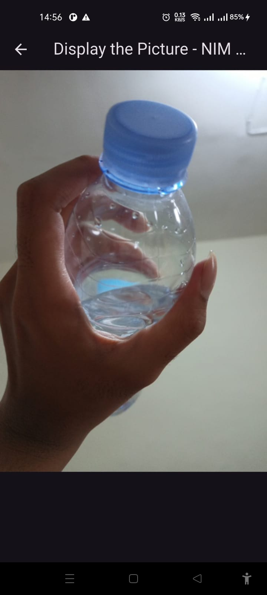

# Bagian 9 - Kamera di Flutter

| Nama:   | Muhammad Afif Al Ghifari |
|---------|--------------------------|
| Kelas:  | TI-3H                    |
| NIM:    | 2341720168               |
| Absen   | 19                       |


## Praktikum 1: Mengambil Foto dengan Kamera di Flutter
1. Buat Project Baru

    
2. Tambah dependensi yang diperlukan

    
3. Ambil Sensor Kamera dari device

    
4. Buat dan inisialisasi CameraController
    ```dart
    import 'package:flutter/material.dart';
    import 'package:camera/camera.dart';
    // A screen that allows users to take a picture using a given camera.
    class TakePictureScreen extends StatefulWidget {
    const TakePictureScreen({
        super.key,
        required this.camera,
    });

    final CameraDescription camera;

    @override
    TakePictureScreenState createState() => TakePictureScreenState();
    }

        class TakePictureScreenState extends State<TakePictureScreen> {
        late CameraController _controller;
        late Future<void> _initializeControllerFuture;

        @override
        void initState() {
            super.initState();
            // To display the current output from the Camera,
            // create a CameraController.
            _controller = CameraController(
            // Get a specific camera from the list of available cameras.
            widget.camera,
            // Define the resolution to use.
            ResolutionPreset.medium,
            );

            // Next, initialize the controller. This returns a Future.
            _initializeControllerFuture = _controller.initialize();
        }

        @override
        void dispose() {
            // Dispose of the controller when the widget is disposed.
            _controller.dispose();
            super.dispose();
        }

        @override
        Widget build(BuildContext context) {
            // Fill this out in the next steps.
            return Container();
        }
    }
    ```

5. Gunakan CameraPreview untuk menampilkan preview foto

    
6. Ambil foto dengan CameraController
    
    
7. Buat widget baru DisplayPictureScreen

    
8. Edit main.dart

    
9. Menampilkan hasil foto

    
    
    

## Praktikum 2: Membuat photo filter carousel
1. Buat project baru

    
2. Buat widget Selector ring dan dark gradient
    ```dart
    import 'package:flutter/foundation.dart';
    import 'package:flutter/material.dart';
    import 'package:camera/camera.dart';

    @immutable
    class FilterSelector extends StatefulWidget {
    const FilterSelector({
        super.key,
        required this.filters,
        required this.onFilterChanged,
        this.padding = const EdgeInsets.symmetric(vertical: 24),
    });

    final List<Color> filters;
    final void Function(Color selectedColor) onFilterChanged;
    final EdgeInsets padding;

    @override
    State<FilterSelector> createState() => _FilterSelectorState();
    }

    class _FilterSelectorState extends State<FilterSelector> {
    static const _filtersPerScreen = 5;
    static const _viewportFractionPerItem = 1.0 / _filtersPerScreen;

    late final PageController _controller;
    late int _page;

    int get filterCount => widget.filters.length;

    Color itemColor(int index) => widget.filters[index % filterCount];

    @override
    void initState() {
        super.initState();
        _page = 0;
        _controller = PageController(
        initialPage: _page,
        viewportFraction: _viewportFractionPerItem,
        );
        _controller.addListener(_onPageChanged);
    }

    void _onPageChanged() {
        final page = (_controller.page ?? 0).round();
        if (page != _page) {
        _page = page;
        widget.onFilterChanged(widget.filters[page]);
        }
    }

    void _onFilterTapped(int index) {
        _controller.animateToPage(
        index,
        duration: const Duration(milliseconds: 450),
        curve: Curves.ease,
        );
    }

    @override
    void dispose() {
        _controller.dispose();
        super.dispose();
    }

    @override
    Widget build(BuildContext context) {
        return Scrollable(
        controller: _controller,
        axisDirection: AxisDirection.right,
        physics: const PageScrollPhysics(),
        viewportBuilder: (context, viewportOffset) {
            return LayoutBuilder(
            builder: (context, constraints) {
                final itemSize = constraints.maxWidth * _viewportFractionPerItem;
                viewportOffset
                ..applyViewportDimension(constraints.maxWidth)
                ..applyContentDimensions(0.0, itemSize * (filterCount - 1));

                return Stack(
                alignment: Alignment.bottomCenter,
                children: [
                    _buildShadowGradient(itemSize),
                    _buildCarousel(
                    viewportOffset: viewportOffset,
                    itemSize: itemSize,
                    ),
                    _buildSelectionRing(itemSize),
                ],
                );
            },
            );
        },
        );
    }

    Widget _buildShadowGradient(double itemSize) {
        return SizedBox(
        height: itemSize * 2 + widget.padding.vertical,
        child: const DecoratedBox(
            decoration: BoxDecoration(
            gradient: LinearGradient(
                begin: Alignment.topCenter,
                end: Alignment.bottomCenter,
                colors: [
                Colors.transparent,
                Colors.black,
                ],
            ),
            ),
            child: SizedBox.expand(),
        ),
        );
    }

    Widget _buildCarousel({
        required ViewportOffset viewportOffset,
        required double itemSize,
    }) {
        return Container(
        height: itemSize,
        margin: widget.padding,
        child: Flow(
            delegate: CarouselFlowDelegate(
            viewportOffset: viewportOffset,
            filtersPerScreen: _filtersPerScreen,
            ),
            children: [
            for (int i = 0; i < filterCount; i++)
                FilterItem(
                onFilterSelected: () => _onFilterTapped(i),
                color: itemColor(i),
                ),
            ],
        ),
        );
    }

    Widget _buildSelectionRing(double itemSize) {
        return IgnorePointer(
        child: Padding(
            padding: widget.padding,
            child: SizedBox(
            width: itemSize,
            height: itemSize,
            child: const DecoratedBox(
                decoration: BoxDecoration(
                shape: BoxShape.circle,
                border: Border.fromBorderSide(
                    BorderSide(width: 6, color: Colors.white),
                ),
                ),
            ),
            ),
        ),
        );
    }
    }
    ```
3. Buat widget photo filter carousel
    ```dart
    import 'package:flutter/material.dart';

    @immutable
    class PhotoFilterCarousel extends StatefulWidget {
    const PhotoFilterCarousel({super.key});

    @override
    State<PhotoFilterCarousel> createState() => _PhotoFilterCarouselState();
    }

    class _PhotoFilterCarouselState extends State<PhotoFilterCarousel> {
    final _filters = [
        Colors.white,
        ...List.generate(
        Colors.primaries.length,
        (index) => Colors.primaries[(index * 4) % Colors.primaries.length],
        )
    ];

    final _filterColor = ValueNotifier<Color>(Colors.white);

    void _onFilterChanged(Color value) {
        _filterColor.value = value;
    }

    @override
    Widget build(BuildContext context) {
        return Material(
        color: Colors.black,
        child: Stack(
            children: [
            Positioned.fill(
                child: _buildPhotoWithFilter(),
            ),
            Positioned(
                left: 0.0,
                right: 0.0,
                bottom: 0.0,
                child: _buildFilterSelector(),
            ),
            ],
        ),
        );
    }

    Widget _buildPhotoWithFilter() {
        return ValueListenableBuilder(
        valueListenable: _filterColor,
        builder: (context, color, child) {
            // Anda bisa ganti dengan foto Anda sendiri
            return Image.network(
            'https://docs.flutter.dev/cookbook/img-files'
            '/effects/instagram-buttons/millennial-dude.jpg',
            color: color.withOpacity(0.5),
            colorBlendMode: BlendMode.color,
            fit: BoxFit.cover,
            );
        },
        );
    }

    Widget _buildFilterSelector() {
        return FilterSelector(
        onFilterChanged: _onFilterChanged,
        filters: _filters,
        );
    }
    }
    ```
4. Membuat filter warna - bagian 1
    ```dart
        import 'dart:math' as math;
        import 'package:flutter/rendering.dart';

        class CarouselFlowDelegate extends FlowDelegate {
        CarouselFlowDelegate({
            required this.viewportOffset,
            required this.filtersPerScreen,
        }) : super(repaint: viewportOffset);

        final ViewportOffset viewportOffset;
        final int filtersPerScreen;

        @override
        void paintChildren(FlowPaintingContext context) {
            final count = context.childCount;

            // All available painting width
            final size = context.size.width;

            // The distance that a single item "page" takes up from the perspective
            // of the scroll paging system. We also use this size for the width and
            // height of a single item.
            final itemExtent = size / filtersPerScreen;

            // The current scroll position expressed as an item fraction, e.g., 0.0,
            // or 1.0, or 1.3, or 2.9, etc. A value of 1.3 indicates that item at
            // index 1 is active, and the user has scrolled 30% towards the item at
            // index 2.
            final active = viewportOffset.pixels / itemExtent;

            // Index of the first item we need to paint at this moment.
            // At most, we paint 3 items to the left of the active item.
            final min = math.max(0, active.floor() - 3).toInt();

            // Index of the last item we need to paint at this moment.
            // At most, we paint 3 items to the right of the active item.
            final max = math.min(count - 1, active.ceil() + 3).toInt();

            // Generate transforms for the visible items and sort by distance.
            for (var index = min; index <= max; index++) {
            final itemXFromCenter = itemExtent * index - viewportOffset.pixels;
            final percentFromCenter = 1.0 - (itemXFromCenter / (size / 2)).abs();
            final itemScale = 0.5 + (percentFromCenter * 0.5);
            final opacity = 0.25 + (percentFromCenter * 0.75);

            final itemTransform = Matrix4.identity()
                ..translate((size - itemExtent) / 2)
                ..translate(itemXFromCenter)
                ..translate(itemExtent / 2, itemExtent / 2)
                ..multiply(Matrix4.diagonal3Values(itemScale, itemScale, 1.0))
                ..translate(-itemExtent / 2, -itemExtent / 2);

            context.paintChild(
                index,
                transform: itemTransform,
                opacity: opacity,
            );
            }
        }

        @override
        bool shouldRepaint(covariant CarouselFlowDelegate oldDelegate) {
            return oldDelegate.viewportOffset != viewportOffset;
        }
        }
    ```
5. Membuat filter warna
    ```dart
    import 'package:flutter/material.dart';
    @immutable
    class FilterItem extends StatelessWidget {
    const FilterItem({
        super.key,
        required this.color,
        this.onFilterSelected,
    });

    final Color color;
    final VoidCallback? onFilterSelected;

    @override
    Widget build(BuildContext context) {
        return GestureDetector(
        onTap: onFilterSelected,
        child: AspectRatio(
            aspectRatio: 1.0,
            child: Padding(
            padding: const EdgeInsets.all(8),
            child: ClipOval(
                child: Image.network(
                'https://docs.flutter.dev/cookbook/img-files'
                '/effects/instagram-buttons/millennial-texture.jpg',
                color: color.withOpacity(0.5),
                colorBlendMode: BlendMode.hardLight,
                ),
            ),
            ),
        ),
        );
    }
    }
    ```
6. Implementasi filter carousel

    
    

## Tugas Praktikum
1. Selesaikan Praktikum 1 dan 2, lalu dokumentasikan dan push ke repository Anda berupa screenshot setiap hasil pekerjaan beserta penjelasannya di file README.md! Jika terdapat error atau kode yang tidak dapat berjalan, silakan Anda perbaiki sesuai tujuan aplikasi dibuat!
2. Gabungkan hasil praktikum 1 dengan hasil praktikum 2 sehingga setelah melakukan pengambilan foto, dapat dibuat filter carouselnya!
    
3. Jelaskan maksud void async pada praktikum 1?<br>
    Jawab:<br>
    Future< void > main() async artinya fungsi main berjalan secara asinkron, bisa memakai await, dan tidak mengembalikan nilai apa pun.
4. Jelaskan fungsi dari anotasi @immutable dan @override ?<br>
    Jawab:<br>
    - Anotasi @immutable digunakan untuk menandai suatu class sebagai tidak dapat diubah (immutable).
    - @override digunakan untuk menandai bahwa sebuah method atau properti sedang menimpa (override) method atau properti dari kelas induk (superclass).
5. Kumpulkan link commit repository GitHub Anda kepada dosen yang telah disepakati!