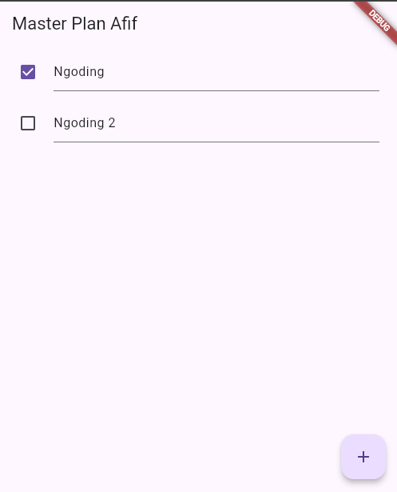
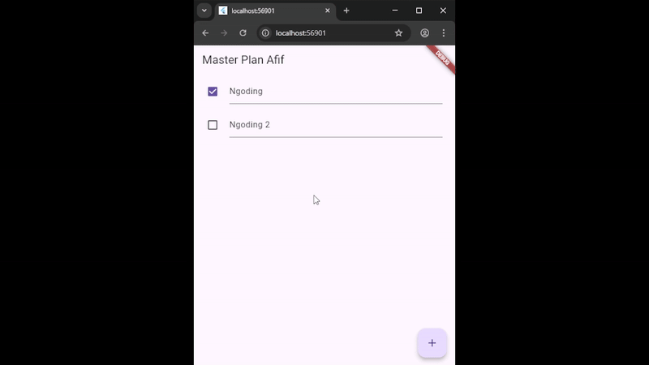
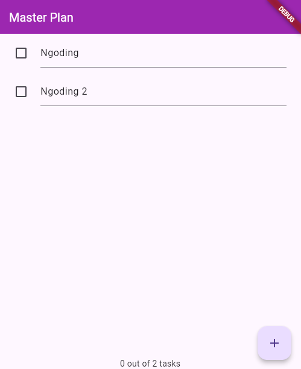
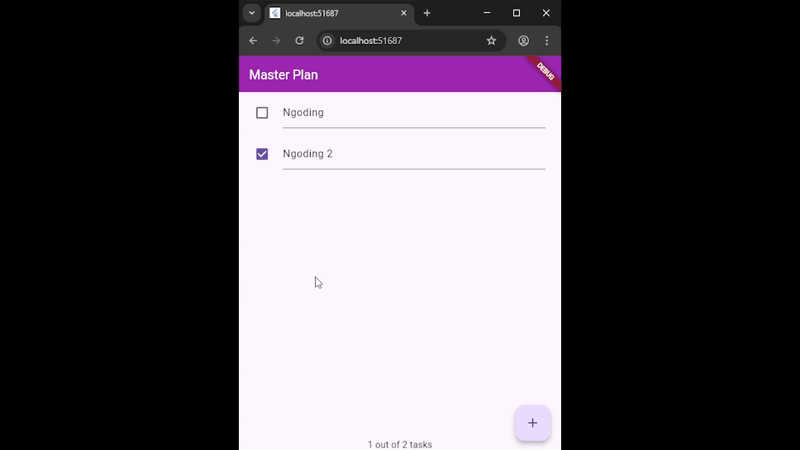
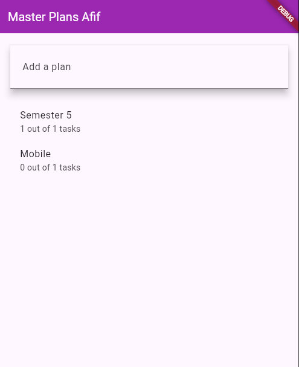
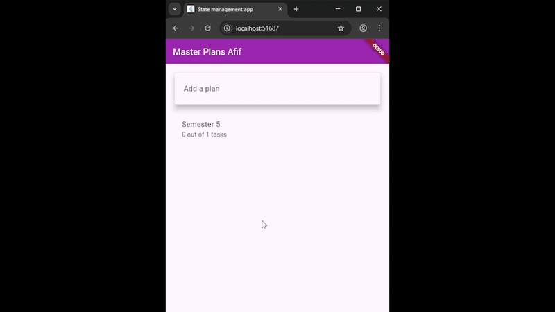

# Bagian 10 - Dasar State Management

| Nama:   | Muhammad Afif Al Ghifari |
|---------|--------------------------|
| Kelas:  | TI-3H                    |
| NIM:    | 2341720168               |
| Absen   | 19                       |

# Praktikum 1
Hasil

# Tugas Praktikum 1
1. Selesaikan langkah-langkah praktikum tersebut, lalu dokumentasikan berupa GIF hasil akhir praktikum beserta penjelasannya di file README.md! Jika Anda menemukan ada yang error atau tidak berjalan dengan baik, silakan diperbaiki. 

2. Jelaskan maksud dari langkah 4 pada praktikum tersebut! Mengapa dilakukan demikian? 
Jawab: 
Data layer yang dibuat untuk mengekspor plan.dart dan task.dart agar file lain cukup mengimpor data.dart untuk mengakses kelas Plan dan Task tanpa mengimpor kedua berkas secara terpisah. 

3. Mengapa perlu variabel plan di langkah 6 pada praktikum tersebut? Mengapa dibuat konstanta ? 
Jawab: 
Variabel plan adalah objek dari class Plan yang menyimpan daftar tugas. Dijadikan const karena agar objek tidak bisa diubah setelah dibuat.

4. Lakukan capture hasil dari Langkah 9 berupa GIF, kemudian jelaskan apa yang telah Anda buat! 
Jawab: 

5. Apa kegunaan method pada Langkah 11 dan 13 dalam lifecyle state ? 
Jawab: 
- Langkah 11 (initState)
Method ini dipanggil saat widget pertama kali dibuat.
Di sini, scrollController diinisialisasi dan diberi listener untuk menutup fokus (misalnya keyboard) ketika pengguna menggulir halaman.
- Langkah 13 (dispose)
Method ini dipanggil saat widget akan dihapus dari tree.
Di sini, scrollController.dispose() digunakan untuk membersihkan resource agar tidak terjadi memory leak setelah widget tidak digunakan lagi.

6. Kumpulkan laporan praktikum Anda berupa link commit atau repository GitHub ke dosen yang telah disepakati !
# Praktikum 2
Hasil

# Tugas Praktikum 2
1. Selesaikan langkah-langkah praktikum tersebut, lalu dokumentasikan berupa GIF hasil akhir praktikum beserta penjelasannya di file README.md! Jika Anda menemukan ada yang error atau tidak berjalan dengan baik, silakan diperbaiki sesuai dengan tujuan aplikasi tersebut dibuat. 
Jawab: 

2. Jelaskan mana yang dimaksud InheritedWidget pada langkah 1 tersebut! Mengapa yang digunakan InheritedNotifier? 
Jawab: 
PlanProvider digunakan untuk mendistribusikan objek ValueNotifier<Plan> ke seluruh subtree widget, dan memastikan UI diperbarui otomatis ketika data Plan berubah.

3. Jelaskan maksud dari method di langkah 3 pada praktikum tersebut! Mengapa dilakukan demikian? 
Jawab: 
Dua getter digunakan untuk menghitung jumlah tugas yang sudah selesai (completedCount) dan membuat pesan ringkas tentang progres tugas (completenessMessage). Dengan menggunakan getter, nilai tersebut selalu dihitung otomatis dan up-to-date setiap kali data tasks berubah — tanpa perlu memanggil fungsi atau menyimpan variabel tambahan.

4. Lakukan capture hasil dari Langkah 9 berupa GIF, kemudian jelaskan apa yang telah Anda buat! 
Jawab: 

5. Kumpulkan laporan praktikum Anda berupa link commit atau repository GitHub ke dosen yang telah disepakati !

# Praktikum 3
Hasil

# Tugas Praktikum 3
1. Selesaikan langkah-langkah praktikum tersebut, lalu dokumentasikan berupa GIF hasil akhir praktikum beserta penjelasannya di file README.md! Jika Anda menemukan ada yang error atau tidak berjalan dengan baik, silakan diperbaiki sesuai dengan tujuan aplikasi tersebut dibuat. 
Jawab: 

2. Berdasarkan Praktikum 3 yang telah Anda lakukan, jelaskan maksud dari gambar diagram berikut ini! 
Jawab: 
Diagram ini menggambarkan alur navigasi antar-widget dalam Flutter, di mana pengguna berpindah dari halaman pembuatan rencana (PlanCreatorScreen) ke halaman tampilan rencana (PlanScreen) menggunakan Navigator.push(), sehingga membentuk hierarki widget baru pada layar berikutnya.

3. Lakukan capture hasil dari Langkah 14 berupa GIF, kemudian jelaskan apa yang telah Anda buat! 
Jawab: 

4. Kumpulkan laporan praktikum Anda berupa link commit atau repository GitHub ke dosen yang telah disepakati !