# Bagian 11 | Pemrograman Asynchronous

| Nama:   | Muhammad Afif Al Ghifari |
|---------|--------------------------|
| Kelas:  | TI-3H                    |
| NIM:    | 2341720168               |
| Absen   | 19                       |

## Praktikum 1

### Soal 1
- Tambahkan nama panggilan Anda pada title app sebagai identitas hasil pekerjaan Anda.
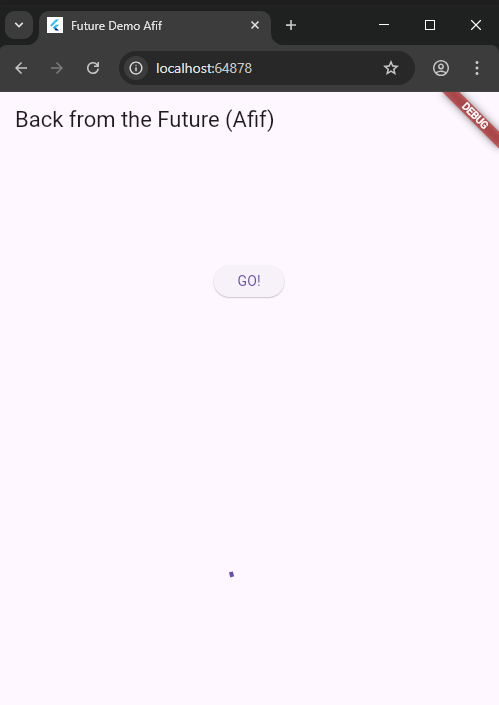

### Soal 2
- Carilah judul buku favorit Anda di Google Books, lalu ganti ID buku pada variabel path di kode tersebut. Caranya ambil di URL browser Anda seperti gambar berikut ini.
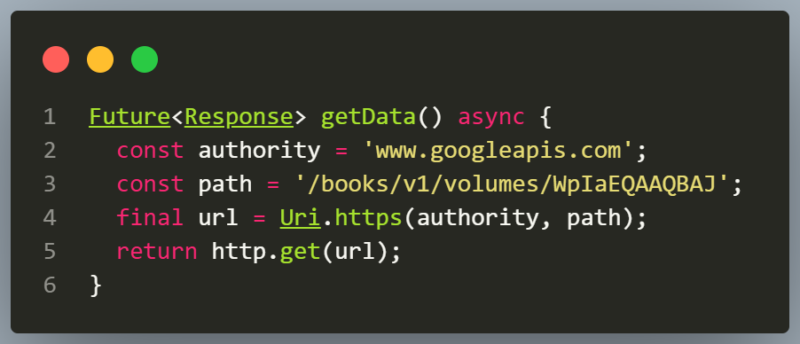

- Kemudian cobalah akses di browser URI tersebut dengan lengkap seperti ini. Jika menampilkan data JSON, maka Anda telah berhasil. Lakukan capture milik Anda dan tulis di README pada laporan praktikum. Lalu lakukan commit dengan pesan "W11: Soal 2".
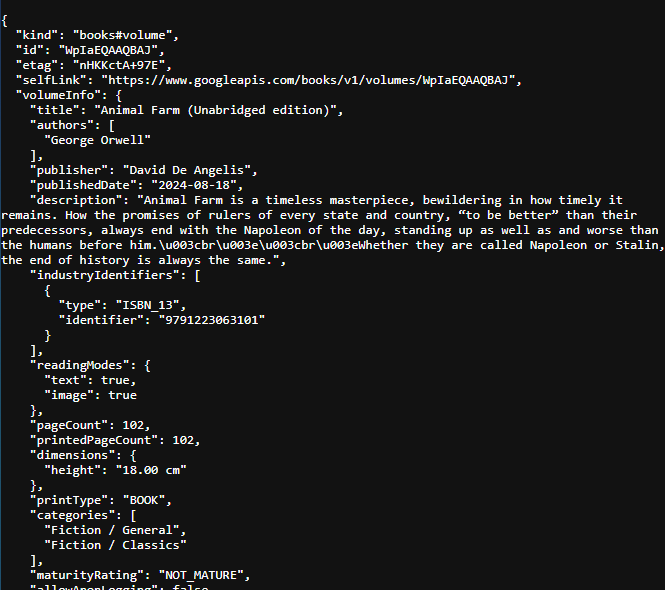

### Soal 3
- Jelaskan maksud kode langkah 5 tersebut terkait substring dan catchError! 
Jawab: 
Substring Memotong teks hasil response agar hanya menampilkan 450 karakter pertama. catchError Menangani error dari Future (misalnya HTTP gagal) dan menampilkan pesan error di UI

- Capture hasil praktikum Anda berupa GIF dan lampirkan di README. Lalu lakukan commit dengan pesan "W11: Soal 3".
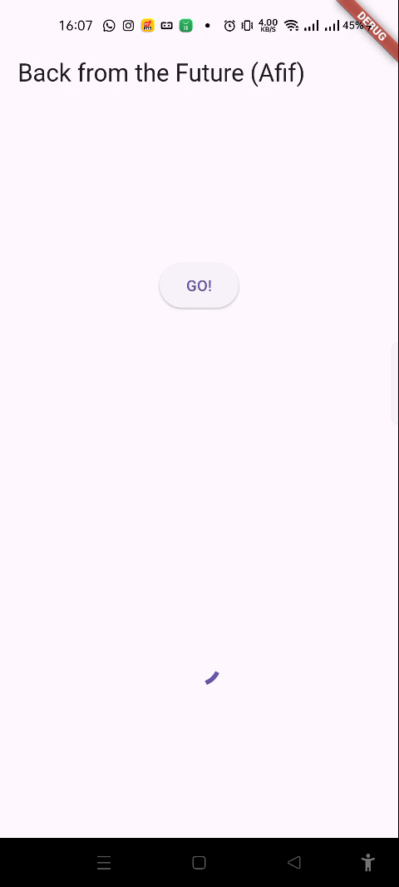

## Praktikum 2

### Soal 4
- Jelaskan maksud kode langkah 1 dan 2 tersebut! 
Jawab: 
    returnOneAsync(), returnTwoAsync(), returnThreeAsync() Masing-masing menunggu 3 detik (Future.delayed) lalu mengembalikan nilai 1, 2, dan 3.

    count() Memanggil ketiga fungsi tadi secara berurutan dengan await, menjumlahkan hasilnya ke variabel total, lalu menampilkan hasilnya ke layar lewat setState().

- Capture hasil praktikum Anda berupa GIF dan lampirkan di README. Lalu lakukan commit dengan pesan "W11: Soal 4".
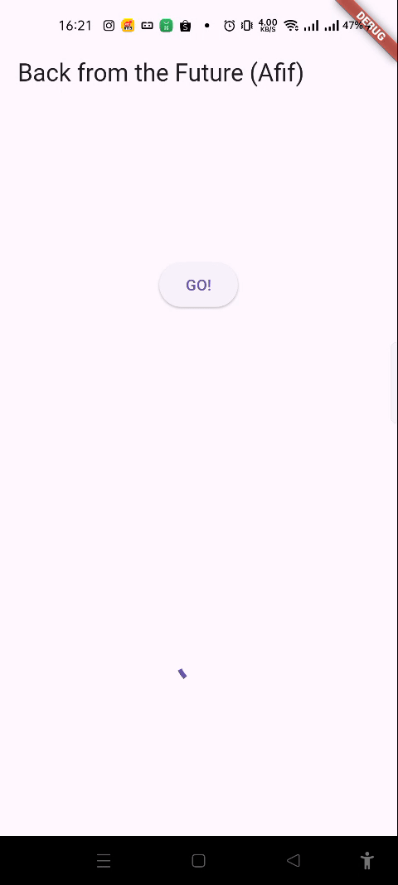

## Praktikum 3

### Soal 5
- Jelaskan maksud kode langkah 2 tersebut!
 
Jawab: 
    getNumber() dipanggil membuat Completer dan menjalankan calculate(). Setelah 5 detik di calculate(), completer.complete(42) menandakan Future selesai. Nilai 42 dikirim ke semua yang sedang await getNumber().

- Capture hasil praktikum Anda berupa GIF dan lampirkan di README. Lalu lakukan commit dengan pesan "W11: Soal 5".
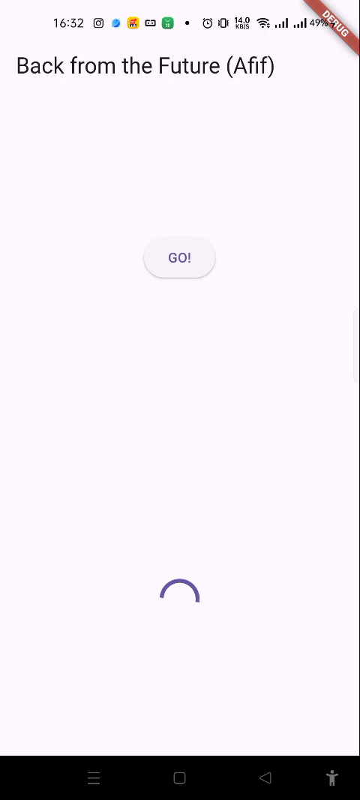

### Soal 6
- Jelaskan maksud perbedaan kode langkah 2 dengan langkah 5-6 tersebut! 
Jawab: 
    - Langkah 2: calculate() tidak punya penanganan error. Jika sesuatu gagal sebelum complete(42) terpanggil, completer.future bisa menggantung (tidak pernah selesai dan tidak pernah error).
    - Langkah 5–6: calculate() dibungkus try/catch, sehingga future selalu berakhir:
        - sukses → complete(42)
        - gagal → completeError(...) Lalu pemanggilnya (getNumber().then(...).catchError(...)) menangani hasil dan error secara eksplisit di UI.

- Capture hasil praktikum Anda berupa GIF dan lampirkan di README. Lalu lakukan commit dengan pesan "W11: Soal 6".

## Praktikum 4

### Soal 7
- Capture hasil praktikum Anda berupa GIF dan lampirkan di README. Lalu lakukan commit dengan pesan "W11: Soal 7".
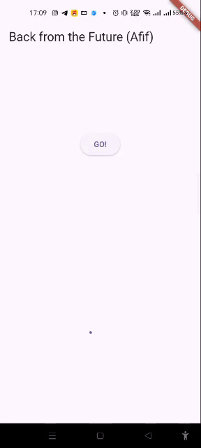

### Soal 8
- Jelaskan maksud perbedaan kode langkah 1 dan 4! 
Jawab: 
    - Gunakan Future.wait kalau semua proses sudah diketahui di awal (kasus kamu: returnOneAsync, returnTwoAsync, returnThreeAsync).
    - Gunakan FutureGroup kalau kamu perlu menambah Future secara dinamis sebelum semuanya dijalankan bersama.

## Praktikum 5

### Soal 9
- Capture hasil praktikum Anda berupa GIF dan lampirkan di README. Lalu lakukan commit dengan pesan "W11: Soal 9".
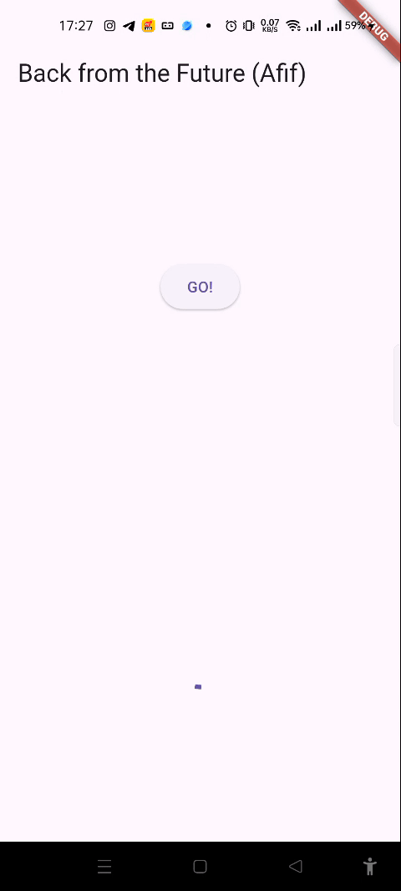

### Soal 10
- Panggil method handleError() tersebut di ElevatedButton, lalu run. Apa hasilnya? Jelaskan perbedaan kode langkah 1 dan 4! 
Jawab: 
    Dari sisi tampilan interface tidak ada perubahan.
        
    - Future returnError() menyimulasikan error asynchronous.Setelah menunggu 2 detik, ia melempar (throw) sebuah Exception dengan pesan: "Something terrible happened". Karena melempar exception, maka Future yang dihasilkan akan berstatus error / gagal.

    - Future handleError() memanggil returnError() dan menangani error-nya agar aplikasi tidak crash.

## Praktikum 6

### Soal 11
- Tambahkan nama panggilan Anda pada tiap properti title sebagai identitas pekerjaan Anda.
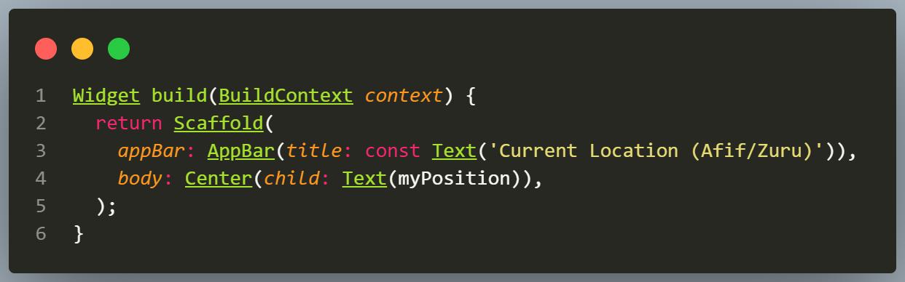

### Soal 12
- Jika Anda tidak melihat animasi loading tampil, kemungkinan itu berjalan sangat cepat. Tambahkan delay pada method getPosition() dengan kode await Future.delayed(const Duration(seconds: 3));
- Apakah Anda mendapatkan koordinat GPS ketika run di browser? Mengapa demikian?
- Capture hasil praktikum Anda berupa GIF dan lampirkan di README. Lalu lakukan commit dengan pesan "W11: Soal 12".
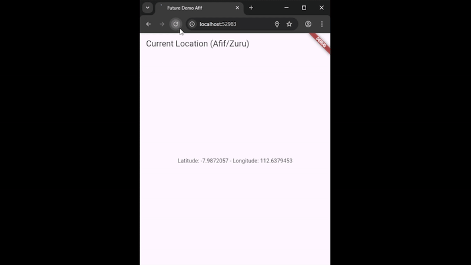

## Praktikum 7

### Soal 13
- Apakah ada perbedaan UI dengan praktikum sebelumnya? Mengapa demikian? 
Jawab: 
    animasi loading dan hasil lokasi diatur secara manual dengan setState(), sedangkan pada praktikum ini digunakan FutureBuilder yang secara otomatis merebuild UI berdasarkan status Future.

- Capture hasil praktikum Anda berupa GIF dan lampirkan di README. Lalu lakukan commit dengan pesan "W11: Soal 13".
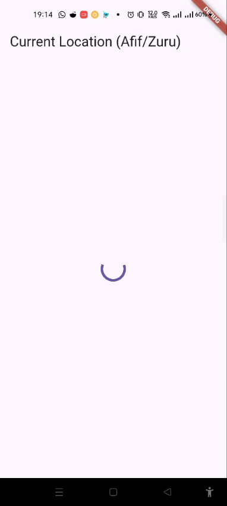

- Seperti yang Anda lihat, menggunakan FutureBuilder lebih efisien, clean, dan reactive dengan Future bersama UI.

### Soal 14
- Apakah ada perbedaan UI dengan langkah sebelumnya? Mengapa demikian? 
Jawab: 
    Ada perubahan dimana saat terjadi error maka akan memunculkan teks'Something terrible happened!'.

- Capture hasil praktikum Anda berupa GIF dan lampirkan di README. Lalu lakukan commit dengan pesan "W11: Soal 14".

## Praktikum 8

### Soal 15
- Tambahkan nama panggilan Anda pada tiap properti title sebagai identitas pekerjaan Anda.
- Silakan ganti dengan warna tema favorit Anda.

### Soal 16
- Cobalah klik setiap button, apa yang terjadi ? Mengapa demikian ?
- Gantilah 3 warna pada langkah 5 dengan warna favorit Anda!
- Capture hasil praktikum Anda berupa GIF dan lampirkan di README. Lalu lakukan commit dengan pesan "W11: Soal 16".

## Praktikum 9

### Soal 17
- Cobalah klik setiap button, apa yang terjadi ? Mengapa demikian ?
- Gantilah 3 warna pada langkah 3 dengan warna favorit Anda!
- Capture hasil praktikum Anda berupa GIF dan lampirkan di README. Lalu lakukan commit dengan pesan "W11: Soal 17".

