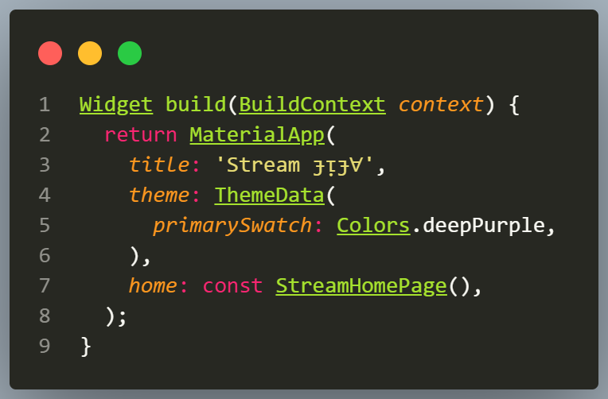
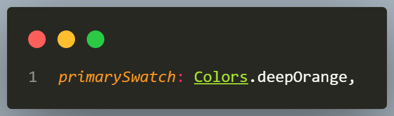
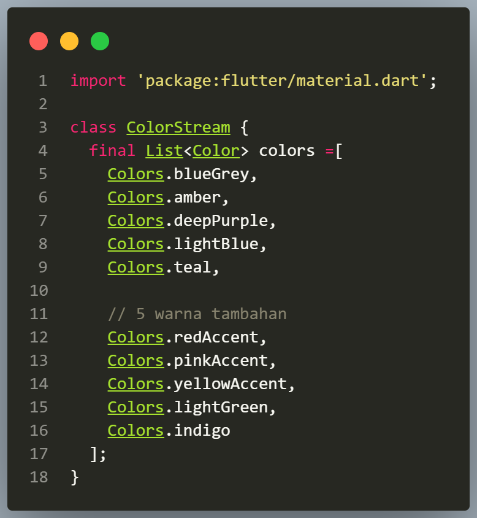
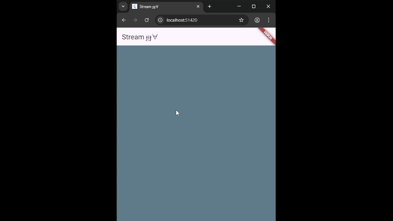
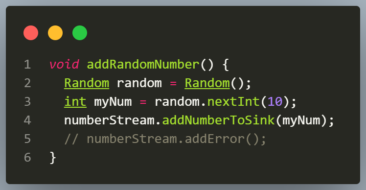
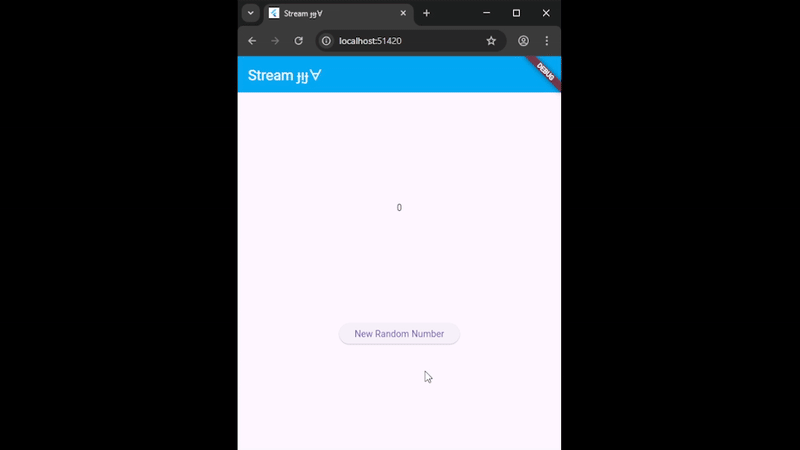

# Bagian 12 | Lanjutan State Management dengan Streams

| Nama:   | Muhammad Afif Al Ghifari |
|---------|--------------------------|
| Kelas:  | TI-3H                    |
| NIM:    | 2341720168               |
| Absen   | 19                       |

## Praktikum 1

### Soal 1
- Tambahkan nama panggilan Anda pada title app sebagai identitas hasil pekerjaan Anda.
    
- Gantilah warna tema aplikasi sesuai kesukaan Anda.
    
- Lakukan commit hasil jawaban Soal 1 dengan pesan "W12: Jawaban Soal 1"

### Soal 2
- Tambahkan 5 warna lainnya sesuai keinginan Anda pada variabel colors tersebut.
    
- Lakukan commit hasil jawaban Soal 2 dengan pesan "W12: Jawaban Soal 2"

### Soal 3
- Jelaskan fungsi keyword yield* pada kode tersebut!
     Jawab: 
    yield* digunakan untuk "meneruskan" (delegate) data dari stream lain ke stream yang kita buat.
- Apa maksud isi perintah kode tersebut?
     Jawab: 
    - Menghasilkan nilai setiap 1 detik
    - Mengambil warna dari list colors berdasarkan indeks yang terus bertambah
    - Setelah indeks mencapai akhir list, akan kembali ke awal (modulus)
    - Menghasilkan stream warna berulang tanpa henti
- Lakukan commit hasil jawaban Soal 3 dengan pesan "W12: Jawaban Soal 3"

### Soal 4
- Capture hasil praktikum Anda berupa GIF dan lampirkan di README.
    
- Lakukan commit hasil jawaban Soal 4 dengan pesan "W12: Jawaban Soal 4"

### Soal 5
- Jelaskan perbedaan menggunakan listen dan await for (langkah 9) !
     Jawab: 
    - await for untuk looping menunggu stream selesai
    - listen() untuk event listener yang berbunyi setiap ada event baru

- Lakukan commit hasil jawaban Soal 5 dengan pesan "W12: Jawaban Soal 5"

## Praktikum 2

### Soal 6
- Jelaskan maksud kode langkah 8 dan 10 tersebut!
     Jawab: 
    - initState()
        - Membuat stream
        - Menghubungkan stream dengan listener
        - Setiap ada angka baru pada stream maka UI update otomatis
    - addRandomNumber()
        - Membuat angka acak
        - Mengirim angka ke stream
        - Listener memproses event yang membuat UI berubah
- Capture hasil praktikum Anda berupa GIF dan lampirkan di README.
    

- Lalu lakukan commit dengan pesan "W12: Jawaban Soal 6".

### Soal 7
- Jelaskan maksud kode langkah 13 sampai 15 tersebut!
     Jawab: 
    - addError(),
        Method ini menambahkan error ke stream menggunakan controller.sink.addError('error'). Tujuannya untuk mensimulasikan kondisi error dalam alur stream.
    - onError di listen(),
        Callback ini menangani error yang dikirim dari stream. Saat error terjadi, nilai lastNumber diubah menjadi -1 agar UI bisa menampilkan status error.
    - addRandomNumber(),
        Method ini mengirim angka acak ke stream dan juga memicu error dengan addError(). Ini menunjukkan bagaimana stream bisa menerima data dan error secara bersamaan.

- Kembalikan kode seperti semula pada Langkah 15, comment addError() agar Anda dapat melanjutkan ke praktikum 3 berikutnya.
    
- Lalu lakukan commit dengan pesan "W12: Jawaban Soal 7".

## Praktikum 3

### Soal 8
- Jelaskan maksud kode langkah 1-3 tersebut!
     Jawab: 
    - Langkah 1: Mendeklarasikan sebuah variabel untuk menyimpan StreamTransformer.
    - Langkah 2: Membuat transformer yang mengalikan semua data dengan 10, mengubah error menjadi angka -1, dan menutup sink saat stream selesai
    - Langkah 3: Menerapkan transformer pada stream, listener menerima data yang sudah dimodifikasi, listener update UI dengan setState, dan error yang lolos transformer ditangani dengan .onError()

- Capture hasil praktikum Anda berupa GIF dan lampirkan di README. 
    

- Lalu lakukan commit dengan pesan "W12: Jawaban Soal 8".

## Praktikum 4

### Soal 9
- Jelaskan maksud kode langkah 2, 6 dan 8 tersebut!
     Jawab: 
    - Langkah 2: Variabel ini berfungsi menyimpan objek langganan (listener) dari sebuah stream. Tujuannya agar kita bisa mengelola dan menghentikan stream secara manual.
    - Langkah 6: Tahap ini mengaktifkan pendengar pada stream. Setiap data yang diterima akan diproses dan diperbarui pada tampilan UI.
    - Langkah 8: Perintah ini digunakan untuk menghentikan langganan pada stream. Setelah dijalankan, stream tidak lagi mengirimkan data ke listener. Biasanya dipakai saat tombol "Stop Subscription" ditekan.

- Capture hasil praktikum Anda berupa GIF dan lampirkan di README.
    
- Lalu lakukan commit dengan pesan "W12: Jawaban Soal 9".

## Praktikum 5

### Soal 10
- Jelaskan mengapa error itu bisa terjadi ?
     Jawab: 
    Kesalahan ini muncul karena satu stream yang sama dipantau lebih dari sekali tanpa dijadikan broadcast. Secara bawaan, stream di Dart adalah single-subscription, sehingga hanya mengizinkan satu listener aktif pada suatu waktu.

### Soal 11
- Jelaskan mengapa hal itu bisa terjadi ?
     Jawab: 
    Situasi itu muncul karena stream yang dipakai merupakan broadcast stream, sehingga memungkinkan banyak subscriber menerima data yang sama secara bersamaan.
- Capture hasil praktikum Anda berupa GIF dan lampirkan di README.
    
- Lalu lakukan commit dengan pesan "W12: Jawaban Soal 10,11".

## Praktikum 6

### Soal 12
- Jelaskan maksud kode pada langkah 3 dan 7 !
- Capture hasil praktikum Anda berupa GIF dan lampirkan di README.
- Lalu lakukan commit dengan pesan "W12: Jawaban Soal 12".

## Praktikum 7

### Soal 13
- Jelaskan maksud praktikum ini ! Dimanakah letak konsep pola BLoC-nya ?
- Capture hasil praktikum Anda berupa GIF dan lampirkan di README.
- Lalu lakukan commit dengan pesan "W12: Jawaban Soal 13".