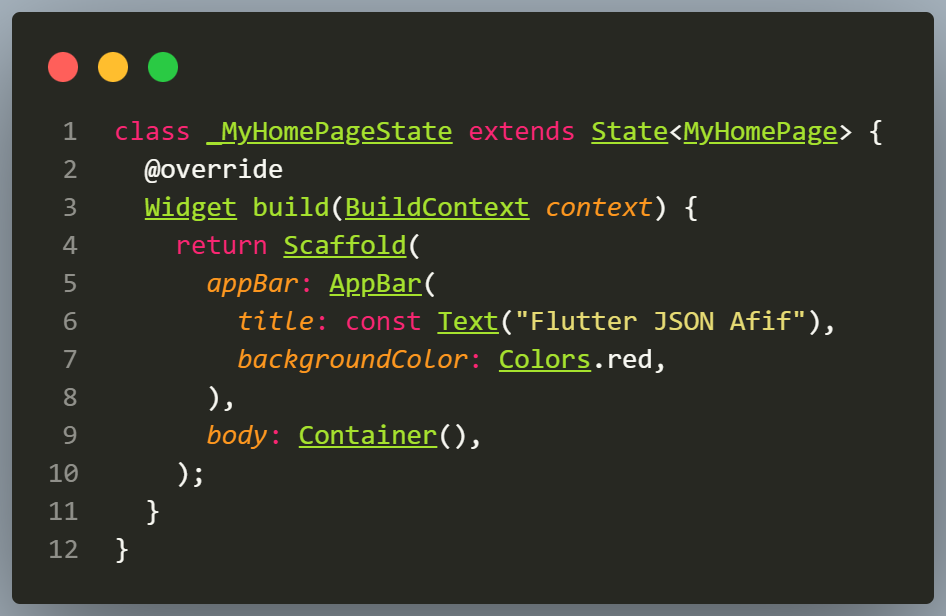
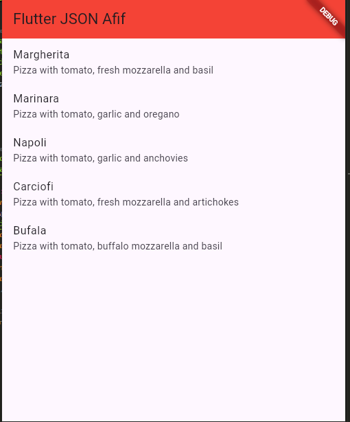
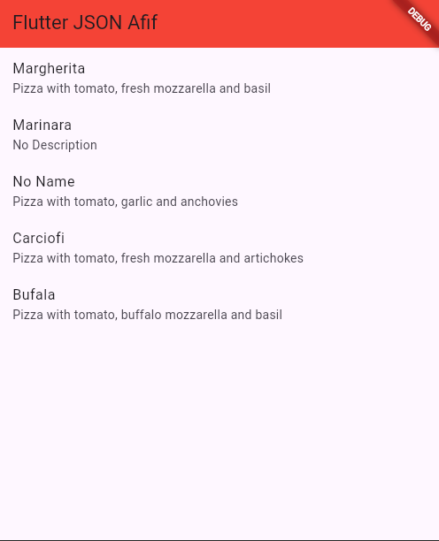
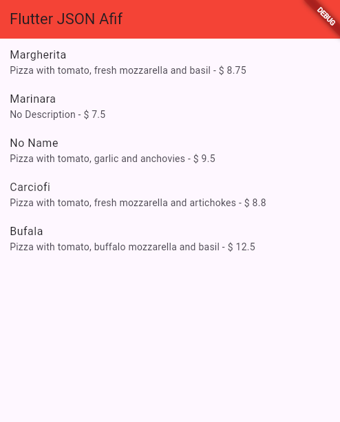
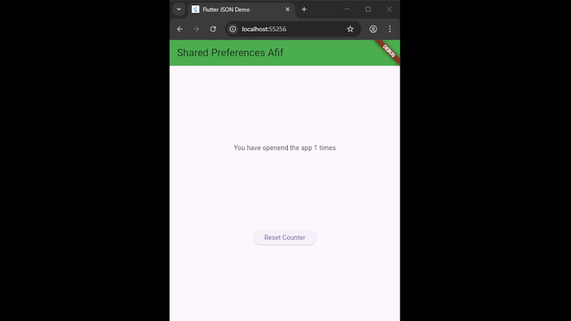

# Bagian 13 | Persistensi Data

| Nama:   | Muhammad Afif Al Ghifari |
|---------|--------------------------|
| Kelas:  | TI-3H                    |
| NIM:    | 2341720168               |
| Absen   | 19                       |

## Praktikum 1
### Soal 1
- Tambahkan nama panggilan Anda pada title app sebagai identitas hasil pekerjaan Anda.
- Gantilah warna tema aplikasi sesuai kesukaan Anda.

- Lakukan commit hasil jawaban Soal 1 dengan pesan "W13: Jawaban Soal 1"

### Soal 2
- Masukkan hasil capture layar ke laporan praktikum Anda.

- Lakukan commit hasil jawaban Soal 2 dengan pesan "W13: Jawaban Soal 2"

### Soal 3
- Masukkan hasil capture layar ke laporan praktikum Anda.

- Lakukan commit hasil jawaban Soal 2 dengan pesan "W13: Jawaban Soal 3"

## Praktikum 2
### Soal 4
- Capture hasil running aplikasi Anda, kemudian impor ke laporan praktikum Anda!

- Lalu lakukan commit dengan pesan "W13: Jawaban Soal 4".

## Praktikum 3
### Soal 5
- Jelaskan maksud kode lebih safe dan maintainable!
 Jawab: 
    Kode lebih safe karena struktur kode jelas dan mudah dikontrol.
    Dan lebih maintainable karena logic dipisah, widget digunakan sesuai fungsinya, dan mudah dikembangkan jika aplikasi bertambah kompleks.
- Capture hasil praktikum Anda dan lampirkan di README.

- Lalu lakukan commit dengan pesan "W13: Jawaban Soal 5".

## Praktikum 4
### Soal 6
- Capture hasil praktikum Anda berupa GIF dan lampirkan di README.

- Lalu lakukan commit dengan pesan "W13: Jawaban Soal 6".

## Praktikum 5
### Soal 7
- Capture hasil praktikum Anda dan lampirkan di README.
- Lalu lakukan commit dengan pesan "W13: Jawaban Soal 7".

## Praktikum 6
### Soal 8
- Jelaskan maksud kode pada langkah 3 dan 7 !
- Capture hasil praktikum Anda berupa GIF dan lampirkan di README.
- Lalu lakukan commit dengan pesan "W13: Jawaban Soal 8".

## Praktikum 7
### Soal 9
- Capture hasil praktikum Anda berupa GIF dan lampirkan di README.
- Lalu lakukan commit dengan pesan "W13: Jawaban Soal 9".